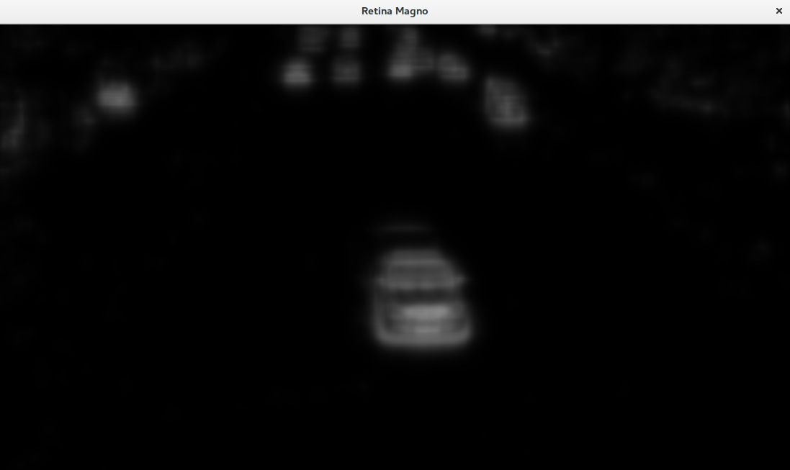

# bioinspired模块

### Retina

##### create方法

| 参数名               | 类型  | 作用                                                         | 测试                                                         |
| -------------------- | ----- | ------------------------------------------------------------ | ------------------------------------------------------------ |
| inputSize            | Size  | 输入图像大小                                                 | 后续的处理图像的大小必须和初始化设置的大小相同               |
| colorSaturationValue | bool  | true表示使用颜色处理，false表示不使用颜色处理                | 设置true或者false对输出图像效果没有明显影响                  |
| colorSamplingMethod  | int   | 颜色采样方法                                                 | cv::bioinspired::RETINA_COLOR_RANDOM，cv::bioinspired::RETINA_COLOR_DIAGONAL，cv::bioinspired::RETINA_COLOR_BAYER，依次调用三个参数，未见输出有明显变化 |
| useRetinaLogSampling | bool  | true表示使用log采样，可继续设置下两个参数；false表示不使用log采样 | 设置为true时，后两个参数才有效                               |
| reductionFactor      | float | 输出图像衰减系数                                             | 测试值0.1-1-10-100未见输出有明显变化                         |
| samplingStrenght     | float | log采样规模的强度                                            | 测试值0.1-1-10-100未见输出有明显变化                         |

###### colorSaturationValue = true

###### colorSaturationValue = false

##### setColorSaturation方法

| 参数名               | 类型  | 作用     | 测试                                                |
| -------------------- | ----- | -------- | --------------------------------------------------- |
| saturateColors       | bool  | 开关     | 值为true则下一个参数有效；值为false则下一个参数无效 |
| colorSaturationValue | float | 饱和度值 | 值越大，输出parvo图像饱和度越高（颜色区分越明显）   |

###### colorSaturationValue = 0

###### colorSaturationValue = 100

##### setupIPLMagnoChannel方法

| 参数名                           | 类型  | 作用                 | 测试                                                         |
| -------------------------------- | ----- | -------------------- | ------------------------------------------------------------ |
| normaliseOutput                  | bool  | 标准化输出           | 归一化之后输出magno图像对比度明显                            |
| parasolCells_beta                | float | 低通滤波器放大系数   | 测试值为0-1-10-100，值越大magno图像边缘越细化                |
| parasolCells_tau                 | float | 低通滤波器的时间常数 | 测试值0-0.3-1-100，在参数大于0.3时输出magno图像背景偏白色    |
| parasolCells_k                   | float | 低通滤波器空间域常数 | 测试值0-1-7-10-50-100，值越大magno图像边缘越模糊             |
| amacrinCellsTemporalCutFrequency | float | 高通滤波器时间常数   | 测试值0-0.1-1-10，值越大背景越亮，值为0是输出全为0，相当于parasolCells_tau弱化 |
| V0CompressionParameter           | float | 压缩强度             | 测试值0-0.1-0.5-0.9，未见明显变化                            |
| localAdaptintegration_tau        | float | 低通滤波器时间常数   | 测试值0-0.1-1-10-100，未见明显变化                           |
| localAdaptintegration_k          | float | 低通滤波器空间域常数 | 测试值0-0.1-1-10-100，未见明显变化                           |

###### normaliseOutput = false

###### normaliseOutput = true

###### parasolCells_beta = 1.0

###### parasolCells_beta = 100.0

###### parasolCells_tau = 0.0白色

###### parasolCells_tau = 0.3

###### parasolCells_k = 0

###### parasolCells_k = 100

##### setupOPLandIPLParvoChannel方法

| 参数名                                   | 类型  | 作用                                          | 测试                                                         |
| ---------------------------------------- | ----- | --------------------------------------------- | ------------------------------------------------------------ |
| colorMode                                | bool  | true表示处理颜色信息，false表示只处理灰度信息 | 为true时输出parvo图像为彩色图，为false是输出parvo图像为灰度图 |
| normaliseOutput                          | bool  | 归一化输出0-255                               | 为true是归一化0-255，输出parvo图像比较正常，为false时不归一化，图像偏暗 |
| photoreceptorsLocalAdaptationSensitivity | float | 光感受器敏感度                                | 测试值0-1-10-100，未见明显变化                               |
| photoreceptorsTemporalConstant           | float | 第一级低通滤波器的时间常数                    | 测试值0-1-10-100，值越大输出parvo图像越模糊（包含越多的历史信息，轨迹） |
| photoreceptorsSpatialConstant            | float | 第一级低通滤波器空间常数                      | 测试值0-0.1-1-10，为0时系统提示警告，值越大输出parvo图像越趋向于灰度图 |
| horizontalCellsGain                      | float | 水平细胞放大系数                              | 测试值0-0.1-1-10，值越大图像亮度越高                         |
| HcellsTemporalConstant                   | float | 水平细胞时间常数                              | 测试值0-1-10-100，值越大亮度越高，但是会慢慢恢复，值越大恢复时间越长 |
| HcellsSpatialConstant                    | float | 水平细胞空间域常数                            | 测试值0-1-10-100，为0时输出全为0                             |
| ganglionCellsSensitivity                 | float | 压缩强度                                      | 值[0,1]区间有效值越大，对比度越明显                          |

###### photoreceptorsTemporalConstant = 0

###### photoreceptorsTemporalConstant = 100

###### photoreceptorsSpatialConstant = 0.1

###### photoreceptorsSpatialConstant = 10

###### HcellsSpatialConstant = 1

###### HcellsSpatialConstant = 100

### TransientAreasSegmentationModule

##### SegmentationParameters

| 成员名                              | 类型  | 作用                         | 测试                                                         |
| ----------------------------------- | ----- | ---------------------------- | ------------------------------------------------------------ |
| thresholdOFF                        | float | OFF通道开关阈值              | 测试值0-1-10-100-1000，未见明显变化                          |
| thresholdON                         | float | ON通道开关阈值               | 测试值0-1-10-100-1000，值为1000时，能滤除大部分背景，但是运动目标的像素也会被滤除一些 |
| contextEnergy_spatialConstant       | float | 背景能量滤波器空间域常数     | 测试值0-1-10-100，值越小越能滤除背景，但是运动物体也会被滤除一些；值越大背景干扰越大 |
| contextEnergy_temporalConstant      | float | 背景能量滤波器时间常数       | 测试值0-1-10-100，值越大，迭代过程越长                       |
| localEnergy_spatialConstant         | float | 局部能量低通滤波器空间域常数 | 测试值0-1-10-100，值越大越能滤除背景，但是运动目标也会被滤除，值为100时输出全为0，值比较小0\1时可以细化目标，但是达不到像素级 |
| localEnergy_temporalConstant        | float | 局部能量低通滤波器时间常数   | 测试值0-1-10-100，值越大，考虑到的历史信息越久，会残留目标的轨迹wending |
| neighborhoodEnergy_spatialConstant  | float | 邻域能量滤波器空间域常数     | 测试值0-1-10，值越小越能滤除背景，且对运动目标保留比较好     |
| neighborhoodEnergy_temporalConstant | float | 领域能量滤波器时间常数       | 测试值0-1-10-100，值越大，算法迭代的时间越长，长时间后效果才会稳定 |

###### localEnergy_spatialConstant = 1

###### localEnergy_spatialConstant = 10

