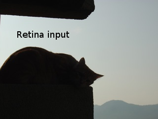
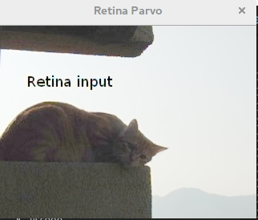
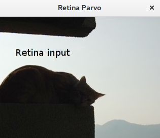
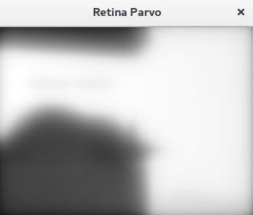
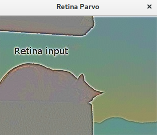
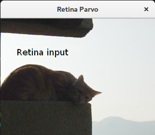

## bioinspired

### Retina

#### setupOPLandIPLParvoChannel

| 参数名                                   | 类型  | 作用                                          | 测试                                                         | 值     |
| ---------------------------------------- | ----- | --------------------------------------------- | ------------------------------------------------------------ | ------ |
| colorMode                                | bool  | true表示处理颜色信息，false表示只处理灰度信息 | 为true时输出parvo图像为彩色图，为false是输出parvo图像为灰度图 | true   |
| normaliseOutput                          | bool  | 归一化输出0-255                               |                                                              | true   |
| photoreceptorsLocalAdaptationSensitivity | float | 光感受器敏感度                                | 测试值0-1-10-100，没有明显变化                               | 0.0f   |
| photoreceptorsTemporalConstant           | float | 第一级低通滤波器的时间常数                    | 值越大图像越暗，值越小图像颜色越艳丽                         | 0.0f   |
| photoreceptorsSpatialConstant            | float | 第一级低通滤波器空间常数                      | 值越大，输出图像越模糊，设置为0比较好                        | 0.0f   |
| horizontalCellsGain                      | float | 水平细胞放大系数                              | 测试值0-1-10-100，没有明显变化                               | 0.0f   |
| HcellsTemporalConstant                   | float | 水平细胞时间常数                              | 值越低颜色对比度越低，值越高颜色对比度越高，但是存在上限     | 100.0f |
| HcellsSpatialConstant                    | float | 水平细胞空间域常数                            | 测试值0-1-100，没有明显变化                                  | 0.9f   |
| ganglionCellsSensitivity                 | float | 压缩强度                                      | 值越大输出图像亮度越大，值越小输出图像亮度越小               | 0.7f   |

###### effection

| official input                 | official output                         |
| ------------------------------ | --------------------------------------- |
|  |  |

| our input = official input     | our output                         |
| ------------------------------ | ---------------------------------- |
|  |  |

###### photoreceptorsTemporalConstant

值越大图像越暗，值越小图像颜色越艳丽

| photoreceptorsTemporalConstant = 0 | photoreceptorsTemporalConstant = 10 |
| ---------------------------------- | ----------------------------------- |
|  |  |

###### photoreceptorsSpatialConstant

值越大，输出图像越模糊，设置为0比较好  

| photoreceptorsSpatialConstant = 0  | photoreceptorsSpatialConstant = 10  |
| ---------------------------------- | ----------------------------------- |
|  |  |

###### HcellsTemporalConstant 

值越低颜色对比度越低，值越高颜色对比度越高，但是存在上限  

| HcellsTemporalConstant = 0         | HcellsTemporalConstant = 100       |
| ---------------------------------- | ---------------------------------- |
|  |  |

###### ganglionCellsSensitivity

值越大输出图像亮度越大，值越小输出图像亮度越小  

| ganglionCellsSensitivity = 0       | ganglionCellsSensitivity = 0.7     |
| ---------------------------------- | ---------------------------------- |
|  |  |
