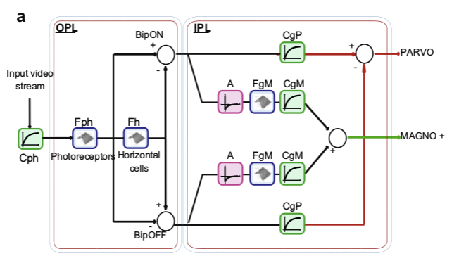
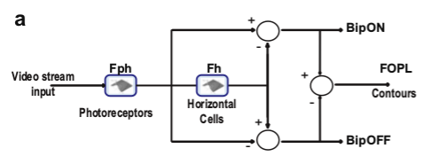
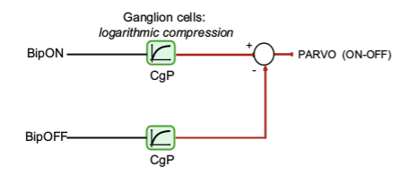
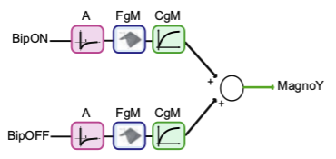

# bioinspired模块

## Retina

模拟人眼视觉细胞，算法中将人眼视觉细胞分为大细胞（Magnocellular）和小细胞（Parvocellular）；大细胞获取运动信息，小细胞获取细节信息。

>the 	Parvocellular channel (Parvo) dedicated to detail extraction and the Magnocellular channel (Magno) dedicated to motion information extraction.

##### 算法介绍

###### 模型



###### 各个滤波器的作用

- $Cph$：根据邻域像素的亮度值，调整像素点$p$的亮度值，用于增强暗区域的对比度，同时保留亮区域的对比度。参数$V_0$值越低，像素$p$对邻域像素亮度敏感度越低。
- $Fph$、$Fh$组成的OPL层：用于去除时间和空间上的噪声，同时增强轮廓信息。BipON和BipOFF是经过OPL层组成的带通滤波器输出的互补的两条信号。
- $A$：高通时域滤波器，用于加强在时空上变化剧烈的区域，实际上是运动的边缘区域。
- $FgM$：与OPL层中$Fph、Fh$相似的滤波器。
- $CgM$：同$CgP$滤波器，用于增强局部轮廓对比度。同时又是一个空域低通滤波器。
- $CgP$：经过OPL层，输入该滤波器的是与轮廓相关的信息，用于再次增强轮廓信息，增强轮廓对比度。

###### 预处理

又叫Outer PixelForm Layer(OPL)，目的是时空滤波与边缘加强。

预处理模仿Michaelis–Menten（[米氏方程](https://baike.baidu.com/item/%E7%B1%B3%E6%B0%8F%E6%96%B9%E7%A8%8B/1236103?fr=aladdin)）的方法，调整输入图像的亮度。
$$
C(p) = \frac{R(p)}{R(p) + R_0(p)} \cdot V_{max} + R_0(p)	\tag 1
$$

$$
R_0(p) = V_0 \cdot L(p) + V_{max} \cdot (1 - V_0)	\tag 2
$$

$C(p)$代表预处理后的输出图像，$R(p)$是当前图像像素的亮度信息，$V_{max}$代表输出像素最大值，$L(p)$代表像素点局部亮度信息，通常可以取局部像素亮度的均值，$V_0$是可调参数。

$C(p)$经过$F_{ph}$和$F_h$两个传递函数，$F_{ph}$模拟的是光感细胞（photoreceptor network），$F_h$模拟的是水平细胞（胶质细胞，horizontal cell network）。
$$
F_{ph} = \frac{1}{1 + \beta_{ph} + 2\alpha_{ph} \cdot (1 - \cos(2\pi f_s)) + 2 j \pi \tau_{ph}f_t}	\tag 3
$$

$$
F_{h} = \frac{1}{1 + \beta_{h} + 2\alpha_{h} \cdot (1 - \cos(2\pi f_s)) + 2 j \pi \tau_{h}f_t}	\tag 4
$$

上式表示为一维形式，实际处理应该转换为二维形式。

其中，**$f_s$代表空域频率信号，$f_t$代表时域频率信号；$\beta_{ph}$是输出$F_{ph}$的增益，通常设置为0，如果输入图像的动态方位增加的话，该值也需要增加；$\beta_h$代表输出$F_h$的增益，设置为0时表示只检测轮廓信息，通过调整该参数可以调整低频增益，从而可以调整图像的亮度平均值；$\tau_{ph}$和$\tau_h$是时域滤波器的时间常数，通过调整该参数，可以减少因时间产生的噪声（即与时间有关的噪声）；$\alpha_{ph}$和$\alpha_h$是空间域滤波器的常数，用来调整空域滤波器的效果，$\alpha_{ph}$用来设置高频信号的截止频率，$\alpha_h$用来设置低频信号的截止频率**。

通过两种模拟细胞之间的差异，我们可以得到OPL层的两种输出：
$$
BipON = F_{ph} - F_h \cdot F_{ph}	\\
BipOFF = F_h \cdot F_{ph} - F_{ph}
$$
最终，预处理输出接口为：



###### Parvo

在Inner PixelForm Layer(IPL)计算。滤波器$CgP$与（1）式类似，都是参考Michaelis–Menten（[米氏方程](https://baike.baidu.com/item/%E7%B1%B3%E6%B0%8F%E6%96%B9%E7%A8%8B/1236103?fr=aladdin)）的方法，用来加强轮廓信息。

> they act as a local enhancer CgP which reinforces the contour data.



###### Magno

在Inner PixelForm Layer(IPL)计算。用来检测运动信息。



滤波器$A$是一个高通时域滤波器，计算方法为：
$$
A(z) = b\cdot \frac {1-z^{-1}}{1-b\cdot z^{-1}}, \ with \ b = e^{-\Delta t / \tau_{A}}	\tag 5
$$
其中，$\Delta t$代表离散时间步长，通常为1，$\tau_A$代表滤波器的时间常数。该滤波器可以用来加强在时空中突变（运动）的区域。

空域低通滤波器$CgM$用来加强局部对比度，空域低通滤波器$FgM$与OPL层类似。

> The result is a high pass temporal filtering of the contour information (A filter) which is smoothed and enhanced (FgM filter and CgM compression).

输入信号，经过时域高通滤波器$A$，获取边缘信息；边缘信息经过滤波器$FgM$和$CgM$的平滑与加强作用后，输出为Magno图像。

##### API

###### C++

```c++
//实例化Retina对象
//参数：
//	inputSize:输入buffer的大小
static Ptr<Retina> cv::bioinspired::Retina::create(Size inputSize);	

//实例化Retina对象，与上一个方法参数列表不同
//参数：
//	inputSize:输入buffer大小
//	colorMode:true表示使用颜色处理，false表示不使用颜色处理
//	colorSamplingMethod:颜色采样方法，可选参数为：
//						cv::bioinspired::RETINA_COLOR_RANDOM,每个像素随机使用R、G、B通道
//						cv::bioinspired::RETINA_COLOR_DIAGONAL，
//						cv::bioinspired::RETINA_COLOR_BAYER，标准bayer采样
//	useRetinaLogSampling:true表示使用log采样，可继续设置下两个参数；false表示不使用log采样
//	reductionFactor:输出图像衰减系数
//	samplingStrenght:log采样规模的强度
static Ptr<Retina> cv::bioinspired::Retina::create(
    Size inputSize,
    const bool colorMode,
    int colorSamplingMethod = RETINA_COLOR_BAYER,
    const bool 	useRetinaLogSampling = false,
    const float reductionFactor = 1.0f,
    const float samplingStrenght = 10.0f 
);

//使用parvocellular（小细胞）通道
//默认参数为true，表示激活该通道；false表示不激活该通道
virtual void activateContoursProcessing(const bool activate)=0;
 
//使用mangocellular（大细胞）通道
//默认参数为true，表示激活该通道；false表示不激活该通道
virtual void activateMovingContoursProcessing(const bool activate)=0;
 
//纠正图像的光照和背光问题，增强阴影处的细节信息
//参数：
//	inputImage:输入图像，格式可以为：CV_32F, CV_32FC1, CV_32F_C3, CV_32F_C4，第四通道不会被考虑
//	outputToneMappedImage:输出图像，格式为CV_8U, CV_8UC3
virtual void applyFastToneMapping(
    InputArray inputImage, 
    OutputArray outputToneMappedImage
    )=0;

//清除缓存，等效于初始化：长时间闭眼后睁眼
virtual void clearBuffers()=0;

//获取magno图像（大细胞图像）
virtual void getMagno(OutputArray retinaOutput_magno)=0;

//获取parvo图像（小细胞图像）
virtual void getParvo(OutputArray retinaOutput_parvo)=0;

//运行算法
virtual void run(InputArray inputImage)=0;

//设置图像饱和度信息，对每个通道使用sigmod函数
//参数：
//	saturateColors:默认为true激活，false表示不激活
//	colorSaturationValue:饱和度值
virtual void setColorSaturation(
    const bool saturateColors=true, 
    const float colorSaturationValue=4.0f
)=0;

//读取算法的参数文件，文件格式为xml
//参数：
//	retinaParameterFile:参数文件路径
//	applyDefaultSetupOnFailure:默认为true表示文件读取错误时抛出错误，false表示不抛出错误
virtual void setup(
    String retinaParameterFile="", 
    const bool applyDefaultSetupOnFailure=true
)=0;

//与上一个函数相同，第一个参数类型不同
virtual void setup(cv::FileStorage &fs, const bool applyDefaultSetupOnFailure=true)=0;
 
//设置参数
virtual void setup(RetinaParameters newParameters)=0;

//设置Magno通道参数
//参数：
//	normaliseOutput:默认为true，表示标准输出（0-255）
//	parasolCells_beta:低通滤波器放大系数，用于局部对比度自适应调整，典型值为0
//	parasolCells_tau:低通滤波器的时间常数，用于局部对比度自适应调整，单位帧，典型值为0
//	parasolCells_k:低通滤波器空间域常数，用于局部对比度自适应调整，单位像素，典型值为5
//	amacrinCellsTemporaCutFrequency:高通滤波器时间常数，单位帧，典型值为5
//	V0CompressionParameter:压缩强度，设置值为0.6-1.0之间效果比较好
//	localAdaptintegration_tau:低通滤波器时间常数
//	localAdaptintegration_k:低通滤波器空间域常数
virtual void setupIPLMagnoChannel(
    const bool normaliseOutput=true, 
    const float parasolCells_beta=0.f, 
    const float parasolCells_tau=0.f, 
    const float parasolCells_k=7.f, 
    const float amacrinCellsTemporalCutFrequency=1.2f, 
    const float V0CompressionParameter=0.95f, 
    const float localAdaptintegration_tau=0.f, 
    const float localAdaptintegration_k=7.f
)=0;

//设置Parvo通道参数
//参数：
//	colorMode:true表示处理颜色信息，false表示只处理灰度信息
//	normaliseOutput:归一化输出0-255
//	photoreceptorsLocalAdaptationSensitivity:光感受器敏感度，0-1，值越高log作用越强
//	photoreceptorsTemporalConstant:第一级低通滤波器的时间常数，单位帧，典型值为1
//	photoreceptorsSpatialConstant:第一级低通滤波器空间常数，单位像素，典型值为1
//	horizontalCellsGain:水平细胞放大系数，值为0则输出均值为0，值趋近于1则无法滤除光照影响
//	HcellsTemporalConstant:水平细胞时间常数，单位帧，典型值1
//	HcellsSpatialConstant:水平细胞空间域常数，单位像素，典型值5
//	ganglionCellsSensitivity:压缩强度，值为0.6-1之间效果比较好
virtual void setupOPLandIPLParvoChannel(
    const bool colorMode=true, 
    const bool normaliseOutput=true, 
    const float photoreceptorsLocalAdaptationSensitivity=0.7f, 
    const float photoreceptorsTemporalConstant=0.5f, 
    const float photoreceptorsSpatialConstant=0.53f, 
    const float horizontalCellsGain=0.f, 
    const float HcellsTemporalConstant=1.f, 
    const float HcellsSpatialConstant=7.f, 
    const float ganglionCellsSensitivity=0.7f
)=0;

//写入算法参数到文件
virtual void write(String fs)const=0;

//写入算法参数到文件，与上一个函数效果相同，参数类型不同
virtual void write(FileStorage &fs) const CV_OVERRIDE=0;

//获取原始的parvo图像（不归一化为0-255）
virtual void getParvoRAW(OutputArray retinaOutput_parvo)=0;

//获取原始的parvo图像（不归一化为0-255），与上一个函数效果相同，参数和返回值类型不同
virtual const Mat getParvoRAW() const =0;
 
//输出使用的参数，字符创类型
virtual const String printSetup()=0;

//获取原始的magno图像（不归一化为0-255）
virtual void getMagnoRAW(OutputArray retinaOutput_magno)=0;

//获取原始的magno图像（不归一化为0-255），与上一个函数效果相同，参数和返回值类型不同
virtual const Mat getMagnoRAW() const =0;
 
//获取算法输出buffer大小，如果之前使用了log域转换，则输出和输入buffer大小可能不同
virtual Size getOutputSize()=0;

//获取算法当前的参数
virtual RetinaParameters getParameters()=0;

//获取输入buffer大小
virtual Size getInputSize()=0;
```

###### Python

```python
#使用parvocellular（大细胞）通道
None = cv2.bioinspired_Retina.activateContoursProcessing(activate)

#使用mangocellular（大细胞）通道
None = cv2.bioinspired_Retina.activateMovingContoursProcessing(activate)

#输出ToneMap图像
outputToneMappedImage = cv2.bioinspired_Retina.applyFastToneMapping(
    inputImage[, outputToneMappedImage]
)

#清除缓存，初始化
None = cv2.bioinspired_Retina.clearBuffers()

#创建实例
retval = cv2.bioinspired.Retina_create(inputSize)

#创建实例，可输出初始化参数
retval = cv2.bioinspired.Retina_create(
    inputSize, 
    colorMode[, 
    colorSamplingMethod[, 
    useRetinaLogSampling[, 
    reductionFactor[,                                                               		samplingStrenght]]]])

#获取输入图像大小
retval = cv2.bioinspired_Retina.getInputSize()

#获取magno图像，归一化
retinaOutput_magno = cv2.bioinspired_Retina.getMagno([, retinaOutput_magno])

#获取原始magno图像，未归一化
retinaOutput_magno = cv2.bioinspired_Retina.getMagnoRAW([, retinaOutput_magno])
retval = cv2.bioinspired_Retina.getMagnoRAW()

#获取输出图像大小
retval = cv2.bioinspired_Retina.getOutputSize()

#获取parvo图像，归一化
retinaOutput_parvo = cv2.bioinspired_Retina.getParvo([, retinaOutput_parvo])

#获取原始的parvo图像，未归一化
retinaOutput_parvo = cv2.bioinspired_Retina.getParvoRAW([, retinaOutput_parvo])
retval = cv2.bioinspired_Retina.getParvoRAW()

#输出算法参数列表
retval = cv2.bioinspired_Retina.printSetup()

#运行算法
None = cv2.bioinspired_Retina.run(inputImage)

#设置对比度及对比度参数
None = cv2.bioinspired_Retina.setColorSaturation(
    [, 
    saturateColors[, 
    colorSaturationValue]])

#从文件读取算法参数
None = cv2.bioinspired_Retina.setup(
    [, 
    retinaParameterFile[, 
    applyDefaultSetupOnFailure]])

#设置magno通道参数
None = cv2.bioinspired_Retina.setupIPLMagnoChannel(
    [, 
    normaliseOutput[, 
    parasolCells_beta[,
    parasolCells_tau[, 
	parasolCells_k[, 
	amacrinCellsTemporalCutFrequency[, 
	V0CompressionParameter[, 
	localAdaptintegration_tau[,
	localAdaptintegration_k]]]]]]]])

#设置parvo通道参数
None = cv2.bioinspired_Retina.setupOPLandIPLParvoChannel(
    [, 
	colorMode[, 
	normaliseOutput[, 
	photoreceptorsLocalAdaptationSensitivity[, 
	photoreceptorsTemporalConstant[, 
	photoreceptorsSpatialConstant[, 
	horizontalCellsGain[, 
	HcellsTemporalConstant[, 
	HcellsSpatialConstant[, 
	ganglionCellsSensitivity]]]]]]]]])

#将算法参数写入文件
None = cv2.bioinspired_Retina.write(fs)
```

##### demo

```c++
try
{
    // create a retina instance with default parameters setup, uncomment the initialisation you wanna test
    cv::Ptr<cv::bioinspired::Retina> myRetina;

    // if the last parameter is 'log', then activate log sampling (favour foveal vision and subsamples peripheral vision)
    if (useLogSampling)
    {
        myRetina = cv::bioinspired::Retina::create(inputFrame.size(),
                                                   true, 
                                                   cv::bioinspired::RETINA_COLOR_BAYER, 
                                                   true, 
                                                   1, 
                                                   0.1);
    }
    else // -> else allocate "classical" retina :
        myRetina = cv::bioinspired::Retina::create(inputFrame.size());

    myRetina->activateContoursProcessing(true);
    myRetina->activateMovingContoursProcessing(true);
    myRetina->setupIPLMagnoChannel(
        true,
        1.0f,
        0.0f,
        0.0f,
        1.0f,
        0.9f,
        100.0f,
        100.0f
    );
    myRetina->setupOPLandIPLParvoChannel(
        true,
        true,
        0.0f,
        0.0f,
        0.1f,
        0.0f,
        0.0f,
        10.0f,
        1.0f
    );        // cv::imshow("Tone Map", toneMap);


    myRetina->setColorSaturation(false, 100);

    // save default retina parameters file in order to let you see this and maybe modify it and reload using method "setup"
    // myRetina->write("RetinaDefaultParameters.xml");

    // load parameters if file exists
    // myRetina->setup("RetinaSpecificParameters.xml");
    myRetina->clearBuffers();

    // declare retina output buffers
    cv::UMat retinaOutput_parvo;
    cv::UMat retinaOutput_magno;
    while (true)
    {
        // if using video stream, then, grabbing a new frame, else, input remains the same
        if (videoCapture.isOpened())
            videoCapture >> inputFrame;
        if (inputFrame.empty())
            break;

        // cv::Mat saturation;
        // run retina filter
        myRetina->run(inputFrame);
        // Retrieve and display retina output
        myRetina->getParvo(retinaOutput_parvo);
        myRetina->getMagno(retinaOutput_magno);
        // cv::imshow("retina input", inputFrame);
        cv::imshow("Retina Parvo", retinaOutput_parvo);
        // cv::imshow("Retina Magno", retinaOutput_magno);

        // cv::Mat toneMap;
        // myRetina->applyFastToneMapping(inputFrame, toneMap);
        // cv::Mat test = toneMap - inputFrame;
        // cv::imshow("Tone Map", toneMap);
        // cv::imshow("test", test);
    }
}
catch (const cv::Exception &e)
{
    std::cerr << "Error using Retina : " << e.what() << std::endl;
}
```


## RetinaFastToneMapping

> This algorithm is already implemented in thre Retina class (retina::applyFastToneMapping) but used it does not require all the retina model to be allocated. This allows a light memory use for low memory devices

没有合适的图像作为输入，用RGB或灰度图像输入时，输出全为0。该算法已集成到retina类中。

##### 算法流程

为了减少数码相机的成本和体积，通常采用表面覆盖一层彩色滤波阵列(CFA)的单CCD或CMOS传感器来捕获图像。这种CFA图像中每个像素只有三基色中的一种颜色分量，也称作马赛克(Mosaic)图像。为了获得全彩色图像，必须采用插值算法恢复每个像素所丢失的颜色信息，这个过程就是颜色插值(即去马赛克)。

1. $H(p) = I_{CFA}(p) * G_H + \frac { \overline{I_{CFA(p)}} }{2}$，$G_H(x, y) = e^{- \frac{x^2 + y^2}{2\delta_H^2}}$，$\delta_H$通常取3。
2. $I_{bip}(p) = (I_{CFA}(max) + H(p)) \frac{I_{CFA}(p)}{I_{CFA}(p) + H(p)}$
3. $A(p) = I_{bip}(p) * G_A + \frac {\overline{I_{bip} (p)} }{2}$，$G_A(x, y) = e^{- \frac{x^2 + y^2}{2\delta_A^2}}$，$\delta_A$通常取1.5
4. $I_{ga}(p) = (I_{bip}(max) + A(p)) \frac{I_{bip}(p)}{I_{bip}(p) + A(p)}$ 
5. $L(p) = I_{ga}(p) * F_{dem}$，$F_{dem} = \frac{1}{256} \begin{bmatrix} 1 & 4 & 6 & 4 & 1 \\ 4 & 16 & 24 & 16 & 4  \\ 6 & 24 & 36 & 24 & 6 \\ 4 & 16 & 24 & 16  & 4 \\ 1 & 4 & 6 & 4 & 1 \\ \end{bmatrix}$
6. $C(p) = I_{ga}(p) - L(p)$
7. $m_R(x, y) = (1 + \cos(\pi x))(1 + \cos(\pi y)) / 4$
8. $m_G(x, y) = (1 - \cos(\pi x))\cos(\pi y) / 2$
9. $m_B(x, y) = (1 - \cos(\pi x))(1 - \cos(\pi y)) / 4$
10. $C_1(x, y)  = C(x, y) \cdot m_R(x, y)$
11. $C_2(x, y)  = C(x, y) \cdot m_G(x, y)$
12. $C_3(x, y)  = C(x, y) \cdot m_B(x, y)$
13. $R(p) = L(p) + C_1(p)$
14. $G(p) = L(p) + C_2(p)$
15. $B(p) = L(p) + C_3(p)$

##### API

###### C++

```c++
//创建实例
//参数：
//	inputSize:输入图像大小
static Ptr<RetinaFastToneMapping> create(Size inputSize);

//计算ToneMap
virtual void applyFastToneMapping(
    InputArray inputImage, 
    OutputArray outputToneMappedImage
    )=0;
 
//设置参数
//	photoreceptorsNeighborhoodRadius:
//	ganglioncellsNeighborhoodRadius:
//	meanLuminanceModulatorK:
virtual void setup(
    const float photoreceptorsNeighborhoodRadius=3.f, 
    const float ganglioncellsNeighborhoodRadius=1.f, 
    const float meanLuminanceModulatorK=1.f
)=0;
```

###### python

```Python
#计算并输出ToneMap图像
outputToneMappedImage =	cv2.bioinspired_RetinaFastToneMapping.applyFastToneMapping(
    inputImage[, 
	outputToneMappedImage])

#创建实例
retval = cv2.bioinspired.RetinaFastToneMapping_create(inputSize)

#设置算法参数
None = cv2.bioinspired_RetinaFastToneMapping.setup(
    [, 
	photoreceptorsNeighborhoodRadius[, 
	ganglioncellsNeighborhoodRadius[, 
	meanLuminanceModulatorK]]])
```


## TransientAreasSegmentationModule

使用retina方法中，magno图像的输入作为输入数据，使用三个时空滤波器：

- 滤波器一：低通滤波器，滤除噪声和滤除输入运动能量信息的局部变化；
- 滤波器二：更强的低通空间滤波器，如果局部运动能量强于周围运动能量，则将该区域判定为运动区域，并分割；
- 滤波器三：低通滤波器，通过更宽范围的滤波帮助提供决策（是否判定为运动区域）信息。

##### API

###### C++

```c++
//参数列表结构体
//成员：
//	float thresholdOFF:OFF开关阈值
//	float thresholdON:ON开关阈值
//	float contextEnergy_spatialConstant:背景能量滤波器空间域常数
//	float contextEnergy_temporalConstant:背景能量滤波器时间常数
//	float localEnergy_spatialConstant:局部能量低通滤波器空间域常数，单位像素，典型值5
//	float localEnergy_temporalConstant:局部能量低通滤波器时间常数，单位帧，典型值0.5
//	float neighborhoodEnergy_spatialConstant:邻域能量滤波器空间域常数
//	float neighborhoodEnergy_temporalConstant:领域能量滤波器时间常数
cv::bioinspired::SegmentationParameters;

//实例化TransientAreasSegmentationModule
//参数：
//	inputSize:输入图像大小
static Ptr<TransientAreasSegmentationModule> create(Size inputSize);

//清除算法缓存，相当于初始化
virtual void clearAllBuffers()=0;

//获取算法参数
virtual SegmentationParameters getParameters()=0;
 
//算法处理后的最终输出图像，二值图（0、255）
virtual void getSegmentationPicture(OutputArray transientAreas)=0;
 
//获取输入输出图像大小
virtual Size getSize()=0;

//输出算法参数，返回值是格式化的参数信息
virtual const String printSetup()=0;
 
//核心算法，通过getSegmentationPicture方法获取输出
//参数：
//	inputToSegment:输入图像，必须和初始化设置的输入图像大小一致
//	channelIndex:处理通道
virtual void run(InputArray inputToSegment, const int channelIndex=0)=0;

//读取算法参数文件
//参数：
//	segmentationParameterFile:算法参数文件路径
//	applyDefaultSetupOnFailure:默认值为true，表示错误时会抛出异常，false表示不抛出异常
virtual void setup(
    String segmentationParameterFile="", 
    const bool applyDefaultSetupOnFailure=true
)=0;

//与上相同，参数类型不同
virtual void setup(cv::FileStorage &fs, const bool applyDefaultSetupOnFailure=true)=0;erzhitu
 
//与上相同，参数列表及类型不同
virtual void setup(SegmentationParameters newParameters)=0;

//写入参数到文件
virtual void write(String fs)const=0;

//写入参数到文件，与上相同，参数类型不同
virtual void write(cv::FileStorage &fs) const CV_OVERRIDE=0;
```

###### python

```python
#清除缓存，初始化
None = cv2.bioinspired_TransientAreasSegmentationModule.clearAllBuffers()

#实例化
retval = cv2.bioinspired.TransientAreasSegmentationModule_create(inputSize)

#获取算法输出图像，用在run之后
transientAreas=cv2.bioinspired_TransientAreasSegmentationModule.getSegmentationPicture(
    [, transientAreas])

#获取输入输出图像大小
retval = cv2.bioinspired_TransientAreasSegmentationModule.getSize()

#获取算法参数
retval = cv2.bioinspired_TransientAreasSegmentationModule.printSetup()

#运行算法
None = cv2.bioinspired_TransientAreasSegmentationModule.run(inputToSegment[, 																		channelIndex])

#从文件读取算法参数
None = cv2.bioinspired_TransientAreasSegmentationModule.setup(
    [, 
    segmentationParameterFile[, 
	applyDefaultSetupOnFailure]])

#向文件写入算法参数
None = cv2.bioinspired_TransientAreasSegmentationModule.write(fs)
```

##### demo

算法输入图像为灰度图，输出图像为二值图。通过getSegmentationPicture方法获取输出图像的像素值为0或1。

```c++
try
{
    // create a retina instance with default parameters setup, uncomment the initialisation you wanna test
    cv::Ptr<cv::bioinspired::TransientAreasSegmentationModule> myRetina;

    myRetina = cv::bioinspired::TransientAreasSegmentationModule::create(inputFrame.size());

    cv::bioinspired::SegmentationParameters params;
    // params.thresholdOFF = 1000;
    // params.thresholdON = 1000;
    // params.contextEnergy_spatialConstant = 5;
    // params.contextEnergy_temporalConstant = 100;
    // params.localEnergy_spatialConstant = 10;
    // params.localEnergy_temporalConstant = 100;
    // params.neighborhoodEnergy_spatialConstant = 1;
    params.neighborhoodEnergy_temporalConstant = 100;
    myRetina->setup(params);

    myRetina->clearAllBuffers();

    cv::String strp = myRetina->printSetup();
    std::cout << strp << std::endl;
    while (true)
    {
        // if using video stream, then, grabbing a new frame, else, input remains the same
        if (videoCapture.isOpened())
            videoCapture >> inputFrame;
        if (inputFrame.empty())
            break;
        cv::cvtColor(inputFrame, inputFrame, cv::COLOR_BGR2GRAY);

        // cv::Mat saturation;
        // run retina filter
        cv::Mat segMap;
        myRetina->run(inputFrame);
        myRetina->getSegmentationPicture(segMap);

        // cv::Scalar mean_map = cv::mean(segMap);
        // const cv::Scalar test = cv::Scalar(0, 0, 0, 0);
        // if (test != mean_map)
        //     std::cout << "nice!" << std::endl;

        // std::cout << (segMap.at<float>(1, 1)*255) << std::endl;
        cv::imshow("seg Map", segMap * 255);
        // cv::imshow("inputFrame", inputFrame);
    }
}
catch (const cv::Exception &e)
{
    std::cerr << "Error using Retina : " << e.what() << std::endl;
}
```


## 参考资料

1. [A Model of Retinal Local Adaptation for the Tone Mapping of Color Filter Array Images, 2007](https://infoscience.epfl.ch/record/99566/files/MeylanAS07JOSA.pdf?version=1)
2. [Using Human Visual System modeling for bio-inspired low level image processing, 2010](http://web.iitd.ac.in/~sumeet/Modelling_Vision.pdf)
3. [Retina enhanced bag of words descriptors for video classification, 2014](https://www.researchgate.net/publication/263970055_Retina_enhanced_bag_of_words_descriptors_for_video_classification?enrichId=rgreq-66168b0724c0fb40132029904cf4166f-XXX&enrichSource=Y292ZXJQYWdlOzI2Mzk3MDA1NTtBUzoxMTk4NDI2OTg5NjA5MDFAMTQwNTU4NDEzNDkzNA%3D%3D&el=1_x_3&_esc=publicationCoverPdf)