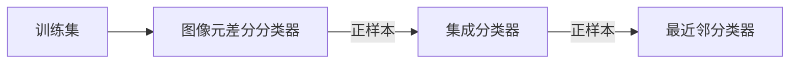

[TOC]

# tracking模块


## 类：

### Tracker：

以下所有类的父类。


### TrackerBoosting：

#### 算法介绍：

本算法采用基于online Boosting在线学习的算法做目标跟踪。

获取第一个目标的Bounding Box之后，生成一个搜索区域，根据搜索区域和目标的Bounding Box可以训练一个分类器，输入新的帧之后在搜索区域内根据上一次的分类器找到目标，再根据当前跟踪到的目标生成搜索区域，重新训练分类器，重复上述过程。


顺序为：a->b->c->d->a

###### 选择ROI区域：

> we have defined by enlarging the target region by one third in each direction (for this region the integral representations are computed).

论文中采用的方法是将Bounding Box四周延长$1/3$，同时计算积分图像和积分直方图。提取ROI区域后再用与上一帧图像相同大小的Bounding Box在ROI区域中滑动，计算不同区域的置信度，置信度最高的区域即为目标。

###### 提取特征：

提取特征的目的是用来生成弱分类器，采用了三种方法提取特征：Haar特征、梯度方向直方图、二值图。

> Note, that the computation of all feature types can be done very efficiently using integral images and integral histograms as data structures.

采用积分图像和积分直方图来提高特征计算的速度。积分图像和积分直方图在提取ROI区域值就开始计算，以减少重复计算。

之后，通过卡尔曼滤波器（Kalman filtering）估计正负样本分布的均值和方差。而求得正负样本的均值和方差后，可以进一步估计正负样本的高斯分布。

###### 计算置信度：

采用online Boosting在线学习的方法。相对于offline Boosting，online Boosting不需要有一个事先训练好的模型，可以在算法的执行过程中训练，这样能提高模型适应性。即，输入一帧图像则训练一次，同时根据训练模型可以给出目标区域。

过程如下：

**弱分类器**：对一个二分类问题，该分类器$h^{weak}$的错误率少于$50\%$，即$e < 0.5$，则可称为弱分类器，它错误率不低，但是执行速度快，且优于随机分类（错误率$50\%$）。

弱分类器是可以根据实际应用自主选择或设计的，甚至可以在每一维度上建立弱分类器。

**选择器**：对$M$个弱分类器的集合$H^{weak} = \{h_1^{weak}, ..., h_M^{weak}\}$，选择器可以选出一个满足下列关系的弱分类器：
$$
h^{select} = h_m^{weak}(X)	\tag1
$$

$$
m = \arg\min_i e_i	\tag2
$$

$e$表示估计误差，上式即选择估计误差最小的一个弱分类器。使用$N$个不同的选择器即可以选择出$N$个不同的弱分类器。对每个选择出来的弱分类器，应该都至少可以对一种特征有比较好的分类效果。

**强分类器：**一个强分类器是$N$个选择器选择出来的弱分类器的线性加权和，通过若干个好的弱分类器的组合，可以认为强分类器可以基本对所有特征有很好的分类效果。
$$
h_{strong} = sign(conf(X))	\tag 3
$$

$$
conf(X) = \sum_{n=1}^N[\alpha _n \cdot h_n^{select}(X)] 	\tag 4
$$

$\alpha_n$是选择器的权重，选择器（弱分类器）的错误率越低，对应权重越高；选择器（弱分类器）的错误率越高，对应权重越低。最终输出即为候选区域判定结果。


#### API：

```c++
//参数设置结构体
//成员变量：
//	int   iterationInit：初始化迭代次数。数值比较大时会增加初始化时间
//	int   numClassifiers：分类器数量。太大时会越界，对算法效果影响较小
//	float samplerOverlap：搜索区域。对算法效果影响较小
//	float samplerSearchFactor：搜索区域。该参数调大可以提高跟踪效果，但是会降低帧率并且增加内存消
//							   耗，甚至导致死机。
//成员函数：
//	void read(const FileNode &fn)：从文件读取参数
//	void write(FileStorage &fs) const：写入参数到文件
cv::TrackerBoosting::Params::Params;

//传入参数
//参数：
//	parameters：		参数结构体
static Ptr<TrackerBoosting> create(const TrackerBoosting::Params &parameters)

//用一个已知的Bounding Box初始化跟踪器
//参数：
//	image：			初始化帧
//	boundingBox：	初始化boundingBox
bool init (InputArray image, const Rect2d &boundingBox);

//更新跟踪器，找到最新的boundingBox
//参数：
//	image：			当前帧
//	boundingBox：	当前帧目标的boundingBox
bool update (InputArray image, Rect2d &boundingBox);
```


#### demo：

```c++
//set the parameters
cv::TrackerBoosting::Params params;
// params.iterationInit = 1;
// params.numClassifiers = 20;
// params.samplerOverlap = 5;
// params.samplerSearchFactor = 5;

//a Boosting tracker object
Ptr<TrackerBoosting> tracker = cv::TrackerBoosting::create(params);

//set a initial boundingBox for initialization
Rect2d boundingBox = selectROI("Tracking API", image);
//set a initial frame for initialization
cap >> frame;
frame.copyTo( image );

//loop from frame to frame
for ( ;; )
{
    if(initialized){
        cap >> frame;
        if(frame.empty()){
            break;
        }
        frame.copyTo( image );
    }

    if( !initialized )
    {
        //initializes the tracker
        if( !tracker->init( frame, boundingBox ) )
        {
            cout << "***Could not initialize tracker...***\n";
            return -1;
        }
        initialized = true;
    }
    else if( initialized )
    {
        int64 frameTime = getTickCount();
        //updates the tracker
        if( tracker->update( frame, boundingBox ) )
        {
            //draw the boundingBox to the current frame
            rectangle( image, boundingBox, Scalar( 255, 0, 0 ), 2, 1 );
        }
    }
    imshow( "Tracking API", image );
}
```


### TrackerCSRT：

#### 算法介绍：

未找到更多资料。

> Discriminative Correlation Filter Tracker with Channel and Spatial Reliability.


#### API：

```C++
//参数设置结构体：
//成员变量：
//	int 	admm_iterations
//	int 	background_ratio
//	float 	cheb_attenuation
//	float 	filter_lr
//	float 	gsl_sigma
//	int 	histogram_bins
//	float 	histogram_lr
//	float 	hog_clip
//	float 	hog_orientations
//	float 	kaiser_alpha
//	int 	num_hog_channels_used
//	int 	number_of_scales
//	float 	padding
//	float 	scale_lr
//	float 	scale_model_max_area
//	float 	scale_sigma_factor
//	float 	scale_step
//	float 	template_size
//	bool 	use_channel_weights
//	bool 	use_color_names：使用cn特征
//	bool 	use_gray：使用灰度特征
//	bool 	use_hog：使用hog特征
//	bool 	use_rgb：使用rgb特征
//	bool 	use_segmentation
//	float 	weights_lr
//	std::string 	window_function：设置窗函数。"hann", "cheb", "kaiser"。
//成员函数：
//	void read(const FileNode &fn)：从文件读取参数
//	void write(FileStorage &fs) const：写入参数到文件
cv::TrackerCSRT::Params::Params()	

//传入参数
//参数：
//	parameters：		参数结构体
static Ptr<TrackerCSRT> create(const TrackerCSRT::Params &parameters)
    
//用一个已知的Bounding Box初始化跟踪器
//参数：
//	image：			初始化帧
//	boundingBox：	初始化boundingBox
bool init (InputArray image, const Rect2d &boundingBox);

//更新跟踪器，找到最新的boundingBox
//参数：
//	image：			当前帧
//	boundingBox：	当前帧目标的boundingBox
bool update (InputArray image, Rect2d &boundingBox);
```


#### demo：

```c++
//set parameters
cv::TrackerCSRT::Params params;
params.window_function = "kaiser";	//"hann", "cheb", "kaiser"
params.use_channel_weights = true;
params.use_color_names = true;
params.use_gray = true;
params.use_hog = true;
params.use_rgb = true;
params.use_segmentation = true;

//create the CSRT object
Ptr<TrackerCSRT> tracker = cv::TrackerCSRT::create(params);

//set a initial boundingBox for initialization
Rect2d boundingBox = selectROI("Tracking API", image);
//set a initial frame for initialization
cap >> frame;
frame.copyTo( image );

//loop from frame to frame
for ( ;; )
{
    if(initialized){
        cap >> frame;
        if(frame.empty()){
            break;
        }
        frame.copyTo( image );
    }

    if( !initialized )
    {
        //initializes the tracker
        if( !tracker->init( frame, boundingBox ) )
        {
            cout << "***Could not initialize tracker...***\n";
            return -1;
        }
        initialized = true;
    }
    else if( initialized )
    {
        int64 frameTime = getTickCount();
        //updates the tracker
        if( tracker->update( frame, boundingBox ) )
        {
            //draw the boundingBox to the current frame
            rectangle( image, boundingBox, Scalar( 255, 0, 0 ), 2, 1 );
        }
    }
    imshow( "Tracking API", image );
}
```


### TrackerGOTURN：

需要安装caffe。

#### 算法介绍：

#### API：

#### demo：


### TrackerKCF：

KCF全称是Kernelized Correlation Filters，核卷积滤波器。

#### 算法介绍：

###### 训练：

对追踪到的目标，通过循环位移近似采样窗口的位移，可以生成多个训练样本。目标为及其循环位移矩阵为正样本，目标附近的采样窗口及其循环位移矩阵为负样本。


该算法目的是训练一个分类器$f(z) = w^T \cdot z$，使得输出误差最小：
$$
\min_{w} \sum_i (f(x_i) - y_i)^2 + \lambda \cdot ||w||^2	\tag 1
$$
其中$\lambda$是正则化参数，求解（1）得到$w$表达式：
$$
w = (X ^ H \cdot X + \lambda \cdot I)^{-1}\cdot X^H\cdot Y	\tag 2
$$
其中，$X^H$是共轭转置，满足$X^H = (X^*)^T$。

根据循环矩阵乘法性质，（2）最终可以得到：
$$
\hat{w} = \frac{\hat{x} \bigodot \hat{y}}{\hat{x}^* \bigodot \hat{x} + \lambda}	\tag 3
$$
$\hat{x}$表示$x$的离散傅里叶变换（DFT）。论文中称，经过上述的计算过程后，脊回归算法的时间复杂度从$O(n^3)$降低到$O(n\log n)$。

上述方法中的特征区分度可能不是很高，为了提高分类器的能力，使用核函数，改变特征维度。将目标分类器改装为：
$$
f(z) = w^T \cdot z = \sum_{i = 1}^{n}\alpha_i\cdot k(z, x_i)	\tag 4
$$
上式$k(\cdot,\cdot)$表示核函数，解算得：
$$
\hat{\alpha} = \frac{\hat{y}}{\hat{k} + \lambda}	\tag 5
$$
其中$k$表示核相关矩阵的生成向量。 

###### 检测：

所有待检测样本和所有训练样本的核相关矩阵为$K$，每一列对应一个待测样本。可以一次计算所有样本的响应（$N×1$向量）：
$$
y^‘ = K^T \cdot \alpha	\tag 6
$$
利用循环矩阵的性质得到：
$$
\hat{y^{'}} = \hat{k} \bigodot \hat{\alpha}	\tag 7
$$

提取响应最高的样本为目标。

###### 核相关矩阵的计算：

无论训练还是检测，都需要计算核相关矩阵$K$的生成向量$k$。除了直接计算每一个核函数，在某些特定的核函数下可以进一步加速。

**多项式核：**

下式$f(\cdot)$表示多项式函数。
$$
k = f[F^{-1}(\hat{y} \bigodot \hat{x}^*)]	\tag 8
$$
**RBF核：**

下式$f(\cdot)$表示线性函数。
$$
k = f[||x||^2 + ||y||^2 + F^{-1}(\hat{y} \bigodot \hat{x}^*)]	\tag 9
$$


#### API：

```c++
//参数设置结构体：
//成员变量：
//	bool 	compress_feature：PCA特征压缩启用开关
//	int 	compressed_size：特征维数
//	int 	desc_npca：不压缩（不采用PCA）的特征描述符，取值cv::TrackerKCF::CN|GRAY|CUSTOM
//	int 	desc_pca：压缩（采用PCA）的特征描述符，取值cv::TrackerKCF::CN|GRAY|CUSTOM
//	float 	detect_thresh：检测器的置信度阈值
//	float 	interp_factor：自适应线性差值因子
//	float 	lambda：正则化参数
//	int 	max_patch_size：roi区域大小
//	float 	output_sigma_factor：空间带宽，与目标成正比
//	float 	pca_learning_rate：PCA学习率
//	bool 	resize：减小特征维度，用于加速
//	float 	sigma：高斯核带宽
//	bool 	split_coeff：将训练系数转化为两个矩阵
//	bool 	wrap_kernel
//成员函数：
//	void read(const FileNode &fn)：从文件读取参数
//	void write(FileStorage &fs) const：写入参数到文件
cv::TrackerKCF::Params::Params()	

//传入参数
//参数：
//	parameters：		参数结构体
static Ptr<TrackerKCF> create(const TrackerKCF::Params &parameters)

//用一个已知的Bounding Box初始化跟踪器
//参数：
//	image：			初始化帧
//	boundingBox：	初始化boundingBox
bool init (InputArray image, const Rect2d &boundingBox);

//更新跟踪器，找到最新的boundingBox
//参数：
//	image：			当前帧
//	boundingBox：	当前帧目标的boundingBox
bool update (InputArray image, Rect2d &boundingBox);
```


#### demo：

```c++
//set parameters
cv::TrackerKCF::Params params;
// params.compress_feature = true;
// params.compressed_size = 10;
// params.pca_learning_rate = 0.9;
// params.resize = false;
// params.desc_pca = cv::TrackerKCF::CN;
// params.detect_thresh = 0.5;
// params.lambda = 0.2;
// params.sigma = 1.5;
// params.split_coeff = true;
// params.wrap_kernel = true;
// params.interp_factor = 10.5;
// params.max_patch_size = 100;
// params.output_sigma_factor = 0.4;

//create a KCF tracker
Ptr<TrackerKCF> tracker = cv::TrackerKCF::create(params);

//set a initial boundingBox for initialization
Rect2d boundingBox = selectROI("Tracking API", image);
//set a initial frame for initialization
cap >> frame;
frame.copyTo( image );

//loop from frame to frame
for ( ;; )
{
    if(initialized){
        cap >> frame;
        if(frame.empty()){
            break;
        }
        frame.copyTo( image );
    }

    if( !initialized )
    {
        //initializes the tracker
        if( !tracker->init( frame, boundingBox ) )
        {
            cout << "***Could not initialize tracker...***\n";
            return -1;
        }
        initialized = true;
    }
    else if( initialized )
    {
        int64 frameTime = getTickCount();
        //updates the tracker
        if( tracker->update( frame, boundingBox ) )
        {
            //draw the boundingBox to the current frame
            rectangle( image, boundingBox, Scalar( 255, 0, 0 ), 2, 1 );
        }
    }
    imshow( "Tracking API", image );
}
```


### TrackerMedianFlow：

MedianFlow跟踪算法实际上是TLD跟踪算法中的一部分，是TLD算法的跟踪模块。

#### 算法介绍：

作者假设一个“好”的追踪算法应该具有正反向连续性（forward-backward consistency），即无论是按照时间上的正序追踪还是反序追踪，产生的轨迹应该是一样的。

规定任意一个追踪器的**FB误差**（forward-backward error）：从时间$t$的初始位置$x(t)$开始追踪产生时间$t+k$的位置$x(t+k)$，再从位置$x(t+k)$反向追踪产生时间$t$的预测位置$x^b(t)$，初始位置和预测位置之间的欧氏距离就作为追踪器在$t$时间的FB误差。


数学描述如下：
$$
T_f^k = (x_t, x_{t+1},...,x_{t+k})	\tag 1
$$

$x_{t+i}$表示$t+i$时刻点$x$的位置，上式$T_f^k$是前向追踪时点的轨迹。

$$
T_b^k = (x_t^b, x_{t+1}^b, ..., x_{t+k}^b)	\tag 2
$$

$T_b^k$表示反向追踪时点的轨迹，其中满足$x_{t+k}^b = x_{t+k}$即前向追踪的终点和反向追踪的起点是重合的。

定义FB误差：

$$
FB(T_f^k|S) = distance(T_f^k, T_b^k)	\tag 3
$$

$distance(\cdot)$是距离描述函数，论文中使用欧式距离，定义如下：

$$
distance(T_f^k, t_b^k) = ||x_t - x_t^b||	\tag 4
$$

采用Lucas-Kanade追踪器，也就是光流追踪器。光流追踪器需要产生一些追踪点， 首先在上一帧$t$的物体包围框里均匀地产生一些点，然后用Lucas-Kanade追踪器正向追踪这些点到$t+1$帧，再反向追踪到$t$帧，计算FB误差，筛选出FB误差最小的一半点作为最佳追踪点。


还可以用NCC（Normalized Cross Correlation，归一化互相关）和SSD（Sum-of-Squared Differences，差值平方和）作为筛选追踪点的衡量标准。作者的代码中是把FB误差和NCC结合起来的，所以筛选出的追踪点比原来一半还要少。

最后根据这些点的坐标变化和距离的变化计算$t+1$帧包围框的位置和大小（平移的尺度取中值，缩放的尺度取中值。取中值的光流法，估计这也是名称Median-Flow的由来吧）。

###### Lucas–Kanade光流算法假设条件：

1. 亮度恒定，就是同一点随着时间的变化，其亮度不会发生改变。这是基本光流法的假定（所有光流法变种都必须满足），用于得到光流法基本方程；
2. 小运动，这个也必须满足，就是时间的变化不会引起位置的剧烈变化，这样灰度才能对位置求偏导（换句话说，小运动情况下我们才能用前后帧之间单位位置变化引起的灰度变化去近似灰度对位置的偏导数），这也是光流法不可或缺的假定；
3. 空间一致，一个场景上邻近的点投影到图像上也是邻近点，且邻近点速度一致。这是Lucas-Kanade光流法特有的假定，因为光流法基本方程约束只有一个，而要求x，y方向的速度，有两个未知变量。我们假定特征点邻域内做相似运动，就可以连立n多个方程求取x，y方向的速度（n为特征点邻域总点数，包括该特征点）。

#### API：

```c++
//参数设置结构体：
//成员变量：
//	int 	maxLevel：Lucas-Kanade算法中，金字塔最高层数
//	double 	maxMedianLengthOfDisplacementDifference：丢失目标的惩罚值
//	int 	pointsInGrid
//	TermCriteria 	termCriteria：Lucas-Kanade算法终止标准
//	cv::Size 	winSize：Lucas-Kanade算法的窗口大小
//	cv::Size 	winSizeNCC：归一化互相关（NCC）窗口
//成员函数：
//	void read(const FileNode &fn)：从文件读取参数
//	void write(FileStorage &fs) const：写入参数到文件
cv::TrackerMedianFlow::Params::Params()	

//传入参数
//参数：
//	parameters：		参数结构体
static Ptr<TrackerMedianFlow> create(const TrackerMedianFlow::Params &parameters)

//用一个已知的Bounding Box初始化跟踪器
//参数：
//	image：			初始化帧
//	boundingBox：	初始化boundingBox
bool init (InputArray image, const Rect2d &boundingBox);

//更新跟踪器，找到最新的boundingBox
//参数：
//	image：			当前帧
//	boundingBox：	当前帧目标的boundingBox
bool update (InputArray image, Rect2d &boundingBox);
```


#### demo：

```c++
//set parameters
cv::TrackerMedianFlow::Params params;
params.maxLevel = 10;
params.maxMedianLengthOfDisplacementDifference = 80.0;
params.pointsInGrid = 10;
params.winSize = cv::Size(20,20);
params.winSizeNCC = cv::Size(20,20);

//create a MedianFlow tracker
Ptr<TrackerMedianFlow> tracker = cv::TrackerMedianFlow::create(params);

//set a initial boundingBox for initialization
Rect2d boundingBox = selectROI("Tracking API", image);
//set a initial frame for initialization
cap >> frame;
frame.copyTo( image );

//loop from frame to frame
for ( ;; )
{
    if(initialized){
        cap >> frame;
        if(frame.empty()){
            break;
        }
        frame.copyTo( image );
    }

    if( !initialized )
    {
        //initializes the tracker
        if( !tracker->init( frame, boundingBox ) )
        {
            cout << "***Could not initialize tracker...***\n";
            return -1;
        }
        initialized = true;
    }
    else if( initialized )
    {
        int64 frameTime = getTickCount();
        //updates the tracker
        if( tracker->update( frame, boundingBox ) )
        {
            //draw the boundingBox to the current frame
            rectangle( image, boundingBox, Scalar( 255, 0, 0 ), 2, 1 );
        }
    }
    imshow( "Tracking API", image );
}
```


### TrackerMIL：

MIL全称是Multiple Instance Learning。

#### 算法介绍：

本算法的重点在于正负样本的选取。

在获取第一帧图像的目标的位置（Bounding Box）之后，选取正负样本。该算法的主要思想是把样本打包，只要一个包中包含一个正样本就将该包设定为正样本包。一在后续的训练中，将包中元素作为输入。

###### 正样本：

在目标位置（一个点）一定范围内随机或按一定的函数式（规律）选取若干个样本。满足：
$$
X^s = \{x | < s \ pixels \ from \ tracker \ location\}	\tag 1
$$
论文中$s$取值为$s = 35$，即在目标位置35个像素的圆内取样本，得到的是目标可能的位置。对$X^s$中的所有样本计算新的跟踪位置$p^`$，即根据预设或训练好的模型，选取响应最大的样本：
$$
location_{new} = location(\mathop{\arg\max}_{x \in X^s} p(y = 1|x))	\tag2
$$
在新的跟踪位置$p^`$运用$(1)$设置一个范围$r$，在以$p^`$为圆心，以$r$为半径的圆内选取若干个样本。将样本打包为正样本包，实际上是扩展正样本，但是将正样本包里面的样本判定为正样本是具有不确定性的。

###### 负样本：

在上述以$(2)$确定的跟踪位置为基础上，以$p^`$为圆心，以$\beta$为和$r$为半径（$\beta > r$）做圆环，在圆环内取若干个样本，都记为负样本。每个负样本都是一个包，并且是负样本包。

###### 训练：

仿照Online-Boosting，构造Online-MIL Boost算法。采用Boost的思想，设置$M$个弱分类器。

弱分类器定义如下：
$$
h_k(x) = \log[\frac{p(y = 1 | f_k(x))}{p(y = 0| f_k(x))}]	\tag 3
$$
$f_k$表示特征，并假设样本特征的条件分布满足高斯分布，均值和方差通过新得到的样本更新：
$$
p(f_k(x)|y = 1) ～ N(u_1, \delta_1) \\
p(f_k(x)|y = 0) ～ N(u_0, \delta_0) \\
p(y = 1) = p(y = 0)
$$
对每一次更新迭代，需要选取最合适的（响应最大）几个弱分类器，选择方法如下：
$$
h_k = \arg\max_{h \in \{h_1 ... h_M\}} \log L(H_{k-1} + h)	\tag4
$$
上式中的$H_{k-1}$表示前$k-1$个弱分类器的组合，也就是前$k-1$个好的弱分类器的组合。MIL分类器为所有好的弱分类器的和（下式的$H$（全部）与$(4)$中的$H$（部分）是不同的）：
$$
H(x) = \sum_{k = 1}^Kh_k(x)	\tag5
$$
结果预测采用下式：
$$
p(y = 1|x) = \sigma(H(x))	\tag 6
$$
其中，$\sigma$为sigmod函数：
$$
\sigma(x) = \frac{1}{1+ e^{-x}}
$$

###### 说明：

1. 弱分类器数量设置时，需要满足所有弱分类器数量$M$远大于好的（候选）弱分类器数量$K$；（$M >> K$，论文中取$M = 250, K = 50$）
2. Boost思想之一：每个弱分类器至少对一个特征有很好的区分能力，所以几个弱分类器的组合可以对所有特征有很好的区分能力；
3. 论文中采用的特征为Haar特征并加入颜色信息。

###### 算法流程：

1. 按式（1）选取一系列图像；
2. 通过式（1）选取的图像，按式（2）计算新的追踪位置；
3. 根据新的追踪位置及式（1）选取正负样本；
4. 通过online-MIL Boost训练和更新分类器；
5. 输入新的一帧，通过训练好的分类器及步骤1、2预测确定目标位置。


#### API：

```c++
//参数设置结构体：
//成员变量：
//	int 	featureSetNumFeatures
//	float 	samplerInitInRadius：初始化过程的正样本搜索半径
//	int 	samplerInitMaxNegNum：初始化过程的最大负样本数
//	float 	samplerSearchWinSize：搜索框大小
//	float 	samplerTrackInRadius：正样本搜索半径
//	int 	samplerTrackMaxNegNum：最大负样本数
//	int 	samplerTrackMaxPosNum：最大正样本数
//成员函数：
//	void read(const FileNode &fn)：从文件读取参数pointsInGrid
//	void write(FileStorage &fs) const：写入参数到文件
cv::TrackerMedianFlow::Params::Params()	

//传入参数
//参数：
//	parameters：		参数结构体
static Ptr<TrackerMedianFlow> create(const TrackerMedianFlow::Params &parameters)

//用一个已知的Bounding Box初始化跟踪器
//参数：
//	image：			初始化帧
//	boundingBox：	初始化boundingBox
bool init (InputArray image, const Rect2d &boundingBox);

//更新跟踪器，找到最新的boundingBox
//参数：
//	image：			当前帧
//	boundingBox：	当前帧目标的boundingBox
bool update (InputArray image, Rect2d &boundingBox);
```


#### demo：

```c++
//set parameters
cv::TrackerMIL::Params params;
// params.featureSetNumFeatures = 1;
params.samplerInitInRadius = 5.0;
params.samplerInitMaxNegNum = 100;
params.samplerSearchWinSize = 10.0;
params.samplerTrackInRadius = 10.0;
params.samplerTrackMaxNegNum = 100;
params.samplerTrackMaxPosNum = 100;

//create a MIL tracker
Ptr<TrackerMIL> tracker = cv::TrackerMIL::create(params);

//set a initial boundingBox for initialization
Rect2d boundingBox = selectROI("Tracking API", image);
//set a initial frame for initialization
cap >> frame;
frame.copyTo( image );

//loop from frame to frame
for ( ;; )
{
    if(initialized){
        cap >> frame;
        if(frame.empty()){
            break;
        }
        frame.copyTo( image );
    }

    if( !initialized )
    {
        //initializes the tracker
        if( !tracker->init( frame, boundingBox ) )
        {
            cout << "***Could not initialize tracker...***\n";
            return -1;
        }
        initialized = true;
    }
    else if( initialized )
    {
        int64 frameTime = getTickCount();
        //updates the tracker
        if( tracker->update( frame, boundingBox ) )
        {
            //draw the boundingBox to the current frame
            rectangle( image, boundingBox, Scalar( 255, 0, 0 ), 2, 1 );
        }
    }
    imshow( "Tracking API", image );
}
```


### TrackerMOSSE：

#### 算法介绍：

该算法基于相关性滤波原理：两个信号越相似，相关性越高。目的是通过一个滤波器使目标响应在搜索区域全局最大。

###### 相关性滤波及滤波函数：

对一幅输入图像$f$，有滤波函数$h$，卷积输出$g$满足：
$$
g_i = convolution(f_i, h_i)	\tag 1
$$
时域卷积等于频域相乘，经过傅里叶变换（采用FFT）后（1）可化为：
$$
G_i = F_i \cdot H_i^T \tag2
$$
$G​$、$F​$、$H​$分别表示$g​$、$f​$、$h​$的傅里叶变换。在实际处理中，傅里叶变换之前，采用了以下三步骤：

1. 对每个像素使用$\log$函数计算，以解决低对比度照明的情况；
2. 像素值归一化；
3. 使用cos函数将像素值置为0附近。

按照论文中的说法，上述操作可以加强目标附近的响应强度。傅里叶变换之后得到我们目标滤波器的表达式：
$$
H_i^T = \frac{G_i}{F_i}	\tag3
$$
工程上通过最小误差平方和（Minimum Output Sum of Squared Error，MOSSE）求取$F$：
$$
\min_{H^T} \sum_i|F_i \cdot H^T - G_i|^2	\tag 4
$$
下标$i$表示的是第$i$个样本。使目标函数导数为0，则求得$H^T$表达式为：
$$
H^T = \frac{\sum_i G_i \cdot F_i^T}{\sum_i F_i \cdot F_i^T}	\tag 5
$$
为了提高滤波器的鲁棒性（适应性），对上式做如下改变，使得历史情况也会影响当前跟踪目标的选择：
$$
\begin{eqnarray}
&H^T = \frac{1}{N} \cdot \sum_i \frac{A_i}{B_i}	\tag 6\\
&A_i = \eta \cdot G_i \cdot F_i^T + (1 - \eta) \cdot A_{i-1}	\tag 7\\
&B_i = \eta \cdot F_i \cdot F_i^T + (1 - \eta) \cdot B_{i-1}	\tag 8
\end{eqnarray}
$$
其中，$N$为样本数，$\eta$是学习率，它会给当前帧更多的权重，并随着时间的推移，权重越低。在论文的实验中发现，$\eta = 0.125$是最好的选择。

###### 获取滤波器输入及输出：

> The training set is constructed using random affine transformations to generate eight small perturbations of the tracking window in the initial frame. Training outputs are also generated with their peaks corresponding to the target center.

滤波器输入$f_i$由目标经过随机的仿射变换得到，论文中每次生成$N=8$个输入样本；

输出样本$g_i$通过高斯函数产生，并且其峰值位置是$f_i$的中心。


#### API：

```c++
//用一个已知的Bounding Box初始化跟踪器
//参数：
//	image：			初始化帧
//	boundingBox：	初始化boundingBox
bool init (InputArray image, const Rect2d &boundingBox);

//更新跟踪器，找到最新的boundingBox
//参数：
//	image：			当前帧
//	boundingBox：	当前帧目标的boundingBox
bool update (InputArray image, Rect2d &boundingBox);
```


#### demo：

```c++
//a tracker object
cv::Ptr<cv::Tracker> tracker;

//init the tracker object to MOSSE
tracker = cv::TrackerMOSSE::create();

//set a initial boundingBox for initialization
Rect2d boundingBox = selectROI("Tracking API", image);
//set a initial frame for initialization
cap >> frame;
frame.copyTo( image );

//loop from frame to frame
for ( ;; )
{
    if(initialized){
        cap >> frame;
        if(frame.empty()){
            break;
        }
        frame.copyTo( image );
    }

    if( !initialized )
    {
        //initializes the tracker
        if( !tracker->init( frame, boundingBox ) )
        {
            cout << "***Could not initialize tracker...***\n";
            return -1;
        }
        initialized = true;
    }
    else if( initialized )
    {
        int64 frameTime = getTickCount();
        //updates the tracker
        if( tracker->update( frame, boundingBox ) )
        {
            //draw the boundingBox to the current frame
            rectangle( image, boundingBox, Scalar( 255, 0, 0 ), 2, 1 );
        }
    }
    imshow( "Tracking API", image );
}
```


### TrackerTLD：

> TLD is a framework designed for long-term tracking of an unknown object in a video stream.

TLD（Tracking-Learning-Detection）算法，用于对目标长时间的追踪，可以适应目标被部分或完全遮挡的情况。

#### 算法介绍：

以下大部分摘自[2](#jump_TLD_2).

###### 算法结构：

TLD算法主要由三个模块构成：追踪器（Tracker）、学习模块（Learning）和检测器（Detector）。


**追踪器**的作用是跟踪连续帧间的运动，当物体始终可见时跟踪器才会有效。追踪器根据物体在前一帧已知的位置估计在当前帧的位置，这样就会产生一条物体运动的轨迹，从这条轨迹可以为学习模块产生正样本（Tracking->Learning）。

**检测器**的作用是估计追踪器的误差，如果误差很大就改正追踪器的结果。检测器对每一帧图像都做全面的扫描，找到与目标物体相似的所有的位置，从检测器产生的结果中产生正样本和负样本，交给学习模块（Detection->Learning）。算法从所有正样本中选出一个最可信的位置作为这一帧TLD的输出结果，然后用这个结果更新追踪器的起始位置（Detection->Tracking）。

**学习模块**根据追踪器和检测器产生的正负样本，迭代训练分类器，改善检测器的精度（Learning->Detection）。

 ###### 追踪模块：

追踪模块使用Median-Flow追踪算法，采用的是Lucas-Kanade追踪器，也就是光流追踪器。

作者假设一个“好”的追踪算法应该具有正反向连续性（forward-backward consistency），即无论是按照时间上的正序追踪还是反序追踪，产生的轨迹应该是一样的。

规定任意一个追踪器的**FB误差**（forward-backward error）：从时间$t$的初始位置$x(t)$开始追踪产生时间$t+k$的位置$x(t+k)$，再从位置$x(t+k)$反向追踪产生时间$t$的预测位置$x^b(t)$，初始位置和预测位置之间的欧氏距离就作为追踪器在$t$时间的FB误差。


光流追踪器需要产生一些追踪点， 首先在上一帧t的物体包围框里均匀地产生一些点，然后用Lucas-Kanade追踪器正向追踪这些点到$t+1$帧，再反向追踪到$t$帧，计算FB误差，筛选出FB误差最小的一半点作为最佳追踪点。

还可以用NCC（Normalized Cross Correlation，归一化互相关）和SSD（Sum-of-Squared Differences，差值平方和）作为筛选追踪点的衡量标准。

最后根据这些点的坐标变化和距离的变化计算$t+1$帧包围框的位置和大小（平移的尺度取中值，缩放的尺度取中值。取中值的光流法，估计这也是名称Median-Flow的由来吧）。

###### 学习模块：

 TLD使用的机器学习方法是作者提出的P-N学习（P-N Learning）。P-N学习是一种半监督的机器学习算法，它针对检测器对样本分类时产生的两种错误提供了两种“专家”进行纠正：

- **P专家（P-expert）**：检出漏检（false negative，正样本误分为负样本）的正样本。寻找数据在时间上的结构性，它利用追踪器的结果预测物体在t+1帧的位置。如果这个位置（包围框）被检测器分类为负，P专家就把这个位置改为正。也就是说P专家要保证物体在连续帧上出现的位置可以构成连续的轨迹；
- **N专家（N-expert）**：改正误检（false positive，负样本误分为正样本）的正样本。寻找数据在空间上的结构性，它把检测器产生的和P专家产生的所有正样本进行比较，选择出一个最可信的位置，保证物体最多只出现在一个位置上，把这个位置作为TLD算法的追踪结果。同时这个位置也用来重新初始化追踪器。

如果算法已经确定物体在t+1帧的位置（实际上是确定了相应包围框的位置），从检测器产生的包围框中筛选出10个与它距离最近的包围框（两个包围框的交的面积除以并的面积大于0.7），对每个包围框做微小的仿射变换（平移10%、缩放10%、旋转10°以内），产生20个图像元，这样就产生200个正样本。再选出若干距离较远的包围框（交的面积除以并的面积小于0.2），产生负样本。

这样产生的样本是已标签的样本，把这些样本放入训练集，用于更新分类器的参数。

###### 检测模块：

检测模块使用一个级联分类器，对从包围框获得的**样本进行分类**。级联分类器包含三个级别：

- **图像元方差分类器（Patch Variance Classifier）**：计算图像元（样本）像素灰度值的方差，把方差小于原始图像元方差一半的样本标记为负。

- **集成分类器（Ensemble Classifier）**：实际上是一个随机蕨分类器（Random Ferns Classifier），类似于随机森林（Random Forest），区别在于随机森林的树中每层节点判断准则不同，而随机蕨的“蕨”中每层只有一种判断准则。

  随机蕨分类器根据样本的特征值判断其分类。从图像元中任意选取两点A和B，比较这两点的亮度值，若A的亮度大于B，则特征值为1，否则为0。每选取一对新位置，就是一个新的特征值。蕨的每个节点就是对一对像素点进行比较。

  只用一个蕨进行分类会有较大的偶然性。另取5个新的特征值就可以构成新的蕨。用很多个蕨对同一样本分类，投票数最大的类就作为新样本的分类，这样在很大程度上提高了分类器的准确度。

- **最近邻分类器（Nearest Neighbor Classifier）**：计算新样本的相对相似度，如大于0.6，则认为是正样本。

  $p_i$和$p_j$是两个图像元，$N(\cdot, \cdot)$是规范化的相关系数，则：
  $$
  \begin{eqnarray}
  S(p_i, p_j) = \frac{N(p_i, p_j) + 1}{2}	\tag 1 \\
  S^+(p,M) = \max_{p_i^+ \in M}S(p, p_i^+)	\tag 2 \\
  S^-(p, M)= \max_{p_i^- \in M}S(p, p_i^-)	\tag 3
  \end{eqnarray}
  $$
  相对相似度计算如下，取值为$[0, 1]$，值越大代表相对相似度越高：
  $$
  S^r = \frac{S^+}{S^+ + S^-}	\tag 4
  $$


分类器作用顺序为：



###### 工作流程：


#### API：

```c++
//用一个已知的Bounding Box初始化跟踪器
//参数：
//	image：			初始化帧
//	boundingBox：	初始化boundingBox
bool init (InputArray image, const Rect2d &boundingBox);

//更新跟踪器，找到最新的boundingBox
//参数：
//	image：			当前帧
//	boundingBox：	当前帧目标的boundingBox
bool update (InputArray image, Rect2d &boundingBox);
```


#### demo：

```c++
//a tracker object
cv::Ptr<cv::Tracker> tracker;

//init the tracker object to TLD
tracker = cv::TrackerTLD::create();

//set a initial boundingBox for initialization
Rect2d boundingBox = selectROI("Tracking API", image);
//set a initial frame for initialization
cap >> frame;
frame.copyTo( image );

//loop from frame to frame
for ( ;; )
{
    if(initialized){
        cap >> frame;
        if(frame.empty()){
            break;
        }
        frame.copyTo( image );
    }

    if( !initialized )
    {
        //initializes the tracker
        if( !tracker->init( frame, boundingBox ) )
        {
            cout << "***Could not initialize tracker...***\n";
            return -1;
        }
        initialized = true;
    }
    else if( initialized )
    {
        int64 frameTime = getTickCount();
        //updates the tracker
        if( tracker->update( frame, boundingBox ) )
        {
            //draw the boundingBox to the current frame
            rectangle( image, boundingBox, Scalar( 255, 0, 0 ), 2, 1 );
        }
    }
    imshow( "Tracking API", image );
}
```


## 参考资料：

#### TrackerBoosting：

1. [Helmut Grabner, Michael Grabner, and Horst Bischof. Real-time tracking via on-line boosting. In *BMVC*, volume 1, page 6, 2006.](http://www.macs.hw.ac.uk/bmvc2006/papers/033.pdf)
2. [【图像处理】利用积分图像法快速计算Haar特征](https://blog.csdn.net/xiaowei_cqu/article/details/8219324)
3. [目标跟踪学习系列一:on-line boosting and vision 阅读](https://blog.csdn.net/ikerpeng/article/details/18985573)


#### TrackerCSRT：


#### TrackerGOTURN：

1. [David Held, Sebastian Thrun, and Silvio Savarese. Learning to track at 100 fps with deep regression networks. In *European Conference Computer Vision (ECCV)*, 2016.](https://arxiv.org/pdf/1604.01802v1.pdf)


#### TrackerKCF：

1. [J. F. Henriques, R. Caseiro, P. Martins, and J. Batista. Exploiting the circulant structure of tracking-by-detection with kernels. In *proceedings of the European Conference on Computer Vision*, 2012.](http://home.isr.uc.pt/~henriques/publications/henriques_eccv2012.pdf)
2. [M. Danelljan, F.S. Khan, M. Felsberg, and J. van de Weijer. Adaptive color attributes for real-time visual tracking. In *Computer Vision and Pattern Recognition (CVPR), 2014 IEEE Conference on*, pages 1090–1097, June 2014.](https://www.cv-foundation.org/openaccess/content_cvpr_2014/papers/Danelljan_Adaptive_Color_Attributes_2014_CVPR_paper.pdf)
3. [High-Speed Tracking with Kernelized Correlation Filters](http://www.robots.ox.ac.uk/~joao/publications/henriques_tpami2015.pdf)
4. [http://www.cvl.isy.liu.se/research/objrec/visualtracking/colvistrack/index.html](http://www.cvl.isy.liu.se/research/objrec/visualtracking/colvistrack/index.html)
5. [【目标跟踪】KCF高速跟踪详解](https://blog.csdn.net/shenxiaolu1984/article/details/50905283)


#### TrackerMedianFlow：

1. [Zdenek Kalal, Krystian Mikolajczyk, and Jiri Matas. Forward-backward error: Automatic detection of tracking failures. In *Pattern Recognition (ICPR), 2010 20th International Conference on*, pages 2756–2759. IEEE, 2010.](https://dspace.cvut.cz/bitstream/handle/10467/9553/2010-forward-backward-error-automatic-detection-of-tracking-failures.pdf?sequence=1&isAllowed=y)
2. [Tracking-Learning-Detection原理分析](http://johnhany.net/2014/05/tld-the-theory/)


#### TrackerMIL：

1. [Boris Babenko, Ming-Hsuan Yang, and Serge Belongie. Visual tracking with online multiple instance learning. In *Computer Vision and Pattern Recognition, 2009. CVPR 2009. IEEE Conference on*, pages 983–990. IEEE, 2009.](http://vision.stanford.edu/teaching/cs231b_spring1415/slides/MIL_kelsie.pdf)
2. [目标跟踪学习系列四：on-line multiple instance learning （MIL）学习](https://blog.csdn.net/ikerpeng/article/details/19235391)


#### TrackerMOSSE：

1. [David S. Bolme, J. Ross Beveridge, Bruce A. Draper, and Man Lui Yui. Visual object tracking using adaptive correlation filters. In *Conference on Computer Vision and Pattern Recognition (CVPR)*, 2010.](http://www.cs.colostate.edu/~draper/papers/bolme_cvpr10.pdf)
2. [相关滤波跟踪（MOSSE）](https://blog.csdn.net/autocyz/article/details/48136473)


#### TrackerTLD：

1. [Zdenek Kalal, Krystian Mikolajczyk, and Jiri Matas. Tracking-learning-detection. *Pattern Analysis and Machine Intelligence, IEEE Transactions on*, 34(7):1409–1422, 2012.](http://kahlan.eps.surrey.ac.uk/featurespace/tld/Publications/2011_tpami)
2. <span id="jump_TLD_2">[Tracking-Learning-Detection原理分析](http://johnhany.net/2014/05/tld-the-theory/)</span>

